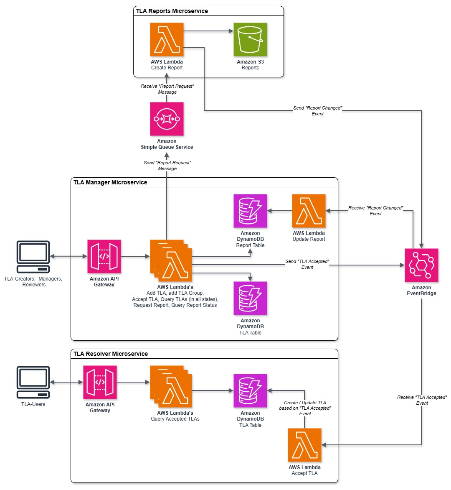
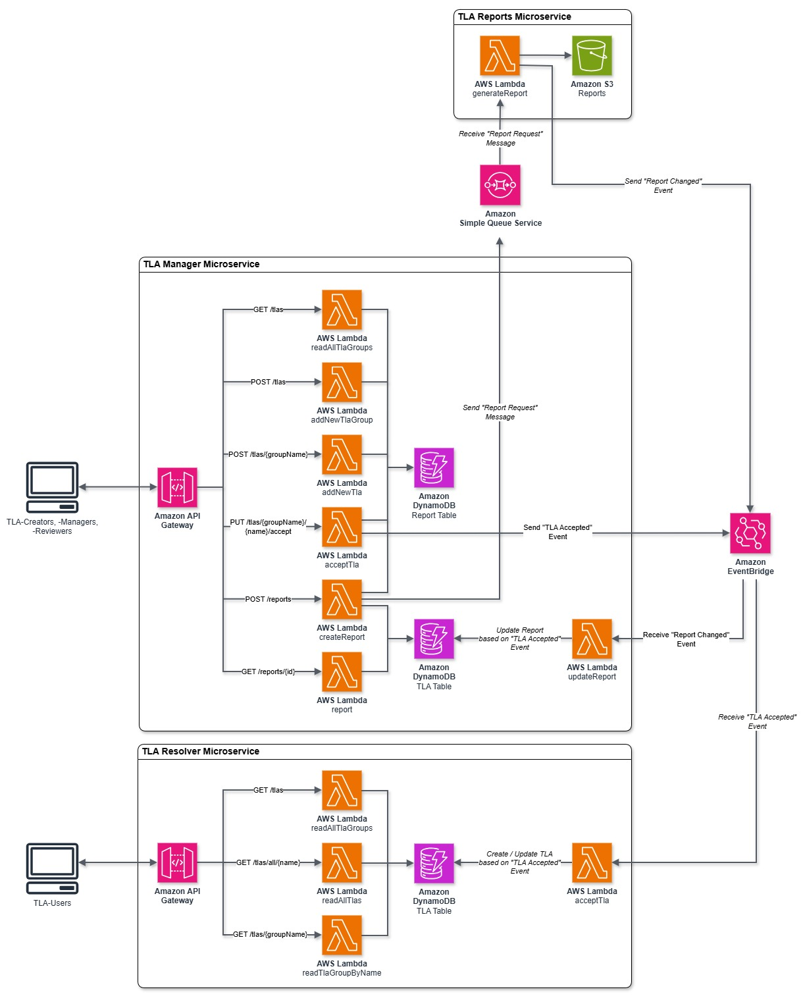

# Three Letter Abbreviations (TLA) Sample Application - Implemented Serverless

[](https://gitlab.ost.ch/cld-sol/fs26/grp21/tla-sample-serverless-eda-dotnet-java/-/commits/main) [](https://opensource.org/licenses/Apache-2.0)

This repository implements the [Three Letter Abbreviations (TLA) Sample Application](https://github.com/ContextMapper/ddd-cm-tla-sample-application) of the [Context Mapper](https://contextmapper.org) project with serverless technology.
It can easily be deployed on AWS.
The following graphic gives an architecture overview of the app:



The app uses the following AWS services:

- **Amazon API Gateway** now serves the RESTful HTTP API to access the TLA's.
- **AWS Lambda** is used (one function per endpoint) to process the request events of the API gateway, load the data from a DynamoDB table and return a response event back to the gateway.
- **Amazon DynamoDB** is used to persist the TLA's.
- **Amazon EventBridge** is used to send events from the manager to the resolver.
- **Amazon S3** is used to save generated TLA reports.
- **Amazon Simple Queue Service** is used to send events from the manager to the report generator.

## Used Technology

The app uses the following tools and frameworks:

- [Maven](https://maven.apache.org/) to build the resolver app deployable (JAR)
- [Spring Boot](https://spring.io/projects/spring-boot) and [Spring Cloud Function](https://spring.io/projects/spring-cloud-function) to implement the resolver functions.
- The [AWS SDK for Java 2.x](https://docs.aws.amazon.com/sdk-for-java/latest/developer-guide/get-started.html) to connect the resolver functions to the DynamoDB and EventBridge.
- [.NET](https://dotnet.microsoft.com/en-us/) to implement the manager functions.
- [Python](https://www.python.org/) to implement the report generator functions.
- The [AWS SDK for .NET](https://docs.aws.amazon.com/sdk-for-net/v4/developer-guide/welcome.html) to connect the manager functions to the DynamoDB and EventBridge.
- The [Serverless Framework](https://www.serverless.com/) to deploy the whole application on AWS.
  - Including the definition of the API endpoints, the DynamoDB table and the EventBridge.
- [GitLab CI/CD Pipelines](https://github.com/OST-Cloud-Application-Lab/tla-sample-serverless-eda-dotnet-java/actions) as CI/CD tool to automatically deploy the app to AWS.

The following graphic shows a more detailed architecture overview:



## Infrastructure

The "TLA Manager", "TLA Resolver" and "TLA Reports" communicate through events that are sent to an Amazon EventBridge and Amazon Simple Queue Service.
This infrastructure needs to be deployed before the other services, using the following commands:

```bash
cd infrastructure
serverless deploy
```

### Event Types

This section documents the different types of events.

The general format of EventBridge events is documented in the [Amazon documentation](https://docs.aws.amazon.com/eventbridge/latest/ref/overiew-event-structure.html).
All events use the "detail-type" to differentiate between the different types of events.

#### TLA Accepted Event

When accepting a TLA (see [Accept a Proposed TLA](#accept-a-proposed-tla)) the "TLA Manager" sends an event to the EventBridge.
The event includes the necessary information for the "TLA Resolver" to add the accepted TLA to its database.
The event has a `detail-type` of `TLA_Accepted`.

The `detail` of the event has the following `data` format:

```json
{
  "tlaGroupName": "{Name of Group}",
  "tlaGroupDescription": "{Description of TLA Group}",
  "tlaName": "{Name of TLA}",
  "tlaMeaning": "{Meaning of TLA}",
  "tlaAlternativeMeanings": [
    "{Alternative meaning 1}",
    "{Alternative meaning 2}"
  ],
  "tlaLink": "{tla link, nullable}"
}
```

Here, an example of an actual event:

```json
{
  "version": "0",
  "id": "4fb14a18-76fe-f6c8-eccf-65d23adfecbb",
  "detail-type": "TLA_Accepted",
  "source": "TLAManager",
  "account": "64...72",
  "time": "2025-05-26T10:52:59Z",
  "region": "us-east-1",
  "resources": [],
  "detail": {
    "metadata": {
      "version": "1.0",
      "created_at": "5/26/2025 10:52:59 AM",
      "domain": {
        "name": "TLAs",
        "subdomain": "review_process",
        "service": "TLAManager",
        "category": "domain_event",
        "event": "TLA_Accepted"
      }
    },
    "data": {
      "tlaGroupName": "OST",
      "tlaGroupDescription": "OST modules",
      "tlaName": "CldSol",
      "tlaMeaning": "Cloud Solutions",
      "tlaAlternativeMeanings": [],
      "tlaLink": null
    }
  }
}
```

#### TLA Report Changed Event

When the status of a TLA report changes, the "TLA Reports" sends and event to the EventBridge.
The event includes the necessary information for the "TLA Manager" to update the report status in its database.
The event has a `detail-type` of `TLAReport_Changed`.

The `detail` of the event has the following `data` format:

```json
{
  "reportId": "{Id of report}",
  "status": "{Status of report (Waiting | Running | Finished)}",
  "url": "{Url of report, when available}"
}
```

Here, an example of an actual event:

```json
{
  "version": "0",
  "id": "74f800ae-ad4e-24df-e65d-f6c96636fe3d",
  "detail-type": "TLAReport_Changed",
  "source": "tla-reports",
  "account": "64...72",
  "time": "2026-04-05T19:32:14Z",
  "region": "us-east-1",
  "resources": [],
  "detail": {
    "metadata": {
      "version": "1.0",
      "created_at": "2026-04-05T19:32:14.109600",
      "domain": {
        "name": "TLAs",
        "subdomain": "report_generation",
        "service": "TLAReports",
        "category": "domain_event",
        "event": "TLAReport_Changed"
      }
    },
    "data": {
      "reportId": "9e44d4ae-8996-4877-88bd-465c11e8a24f",
      "status": "Running",
      "url": null
    }
  }
}
```

### Queue Message Types

This section documents the queue message type.

In the [Amazon documentation](https://docs.aws.amazon.com/lambda/latest/dg/with-sqs.html) is described how to use lambdas with Amazon SQS.

#### TLA Report Request Message

When a TLA report is requested the "TLA Manager" sends a message into the simple queue service.
The message includes all the necessary information for the "TLA Reports" to generate the requested report.
The body contains the same structure as the previous described structures of the event types

```json
"Records": [
    {
      "messageId": "{}",
      "receiptHandle": "{}",
      "body": "{}",
      "attributes": {
          "ApproximateReceiveCount": "1",
          "AWSTraceHeader": "{}",
          "SentTimestamp": "{}",
          "SenderId": "A...M:tla-manager-serverless-dev-createReport",
          "ApproximateFirstReceiveTimestamp": "{}"
      },
      "messageAttributes": {},
      "md5OfBody": "{}",
      "eventSource": "aws:sqs",
      "eventSourceARN": "arn:aws:sqs:us-east-1:6...2:tla-report-queue-dev",
      "awsRegion": "us-east-1"
    }
]
```

Here, an example of the `body` of an actual event:

```json
"body": "{\n  \"metadata\": {\n    \"version\": \"1.0\",\n    \"created_at\": \"4/5/2026 6:31:46 PM\",\n    \"domain\": {\n      \"name\": \"TLAs\",\n      \"subdomain\": \"report_generation\",\n      \"service\": \"TLAManager\",\n      \"category\": \"domain_event\",\n      \"event\": \"TLAReport_Requested\"\n    }\n  },\n  \"data\": {\n    \"reportId\": \"4fd19fe5-0ff6-48cb-b287-8610988d5cfb\",\n    \"tlaGroups\": [\n      {\n        \"name\": \"DDD\",\n        \"description\": \"Domain-Driven Design\",\n        \"tlAs\": [\n          {\n            \"name\": \"ACL\",\n            \"meaning\": \"Anticorruption Layer\",\n            \"alternativeMeanings\": [],\n            \"status\": \"Accepted\",\n            \"link\": null\n          },\n          {\n            \"name\": \"CF\",\n            \"meaning\": \"Conformist\",\n            \"alternativeMeanings\": [],\n            \"status\": \"Accepted\",\n            \"link\": null\n          },\n          {\n            \"name\": \"OHS\",\n            \"meaning\": \"Open Host Service\",\n            \"alternativeMeanings\": [],\n            \"status\": \"Accepted\",\n            \"link\": null\n          },\n          {\n            \"name\": \"PL\",\n            \"meaning\": \"Published Language\",\n            \"alternativeMeanings\": [],\n            \"status\": \"Accepted\",\n            \"link\": null\n          },\n          {\n            \"name\": \"SK\",\n            \"meaning\": \"Shared Kernel\",\n            \"alternativeMeanings\": [],\n            \"status\": \"Accepted\",\n            \"link\": null\n          }\n        ]\n      }\n    ]\n  }\n}"
```

## TLA Manager

### Build and Deploy

As a prerequisite, you must have the [.NET 10 SDK](https://dotnet.microsoft.com/en-us/download) and the [serverless CLI](https://www.serverless.com/framework/docs/getting-started) installed.

Building the app is done using the dotnet CLI.
We provide a build script which executes the necessary commands for you:

```bash
cd manager
./.build.sh
```

The command above creates a zip file `bin/release/net10.0/deploy-package.zip` which contains all the functions (lambdas) of the app.
Once successfully built, the app is easily deployed with:

```bash
serverless deploy
```

_Note:_ `serverless deploy` only works if you have already set up the serverless framework locally, including logging in and connecting to your AWS account. See the [Serverless Framework documentation](https://www.serverless.com/framework/docs/getting-started) for more information on how to do this.

Once `serverless deploy` was successful, you can fill the DynamoDB table with some sample data by executing our `seedDatabase` function. You can do this via the following command:

```bash
sls invoke --function seedDatabase --data 'unused'
```

Now you can access the TLA's via the apps API.

### Use Cases and Endpoints

The manager currently supports the following use cases, for which we provide some sample CURLs.

_Disclaimer:_ Please note that we have not implemented any identity and access control measures for this sample application. All endpoints are publicly available; including the writing ones (commands).

_Note_ that you will need to replace `{baseUrl}` with the URLs you get from `sls deploy` in all the following examples.

| Endpoint                        | Method | Description                                                                                                                                                                                   |
| ------------------------------- | ------ | --------------------------------------------------------------------------------------------------------------------------------------------------------------------------------------------- |
| /tlas                           | GET    | Get all TLA groups including their TLAs (accepted TLAs only).                                                                                                                                 |
| /tlas?status=PROPOSED           | GET    | Get TLAs in PROPOSED state.                                                                                                                                                                   |
| /tlas                           | POST   | Create a new TLA group (see sample payload below). Containing TLAs will be in PROPOSED state.                                                                                                 |
| /tlas/{groupName}               | POST   | Create a new TLA within an existing group (see sample payload below). The created TLA will be in PROPOSED state.                                                                              |
| /tlas/{groupName}/{name}/accept | PUT    | Accept a proposed TLA ([state transition operation](https://microservice-api-patterns.org/patterns/responsibility/operationResponsibilities/StateTransitionOperation): PROPOSED -> ACCEPTED). |
| /reports                        | POST   | Create a new TLA report (see sample payload below). Containing groups will be included in the generated report                                                                                |
| /reports{id}                    | GET    | Get the status of the TLA report. Either the status when report not generated yet, or the url to the report.                                                                                  |

#### Get All TLA Groups

The `/tlas` (GET) endpoint returns all TLAs of all TLA groups that are in the `ACCEPTED` state (read on to see how to propose and accept new TLAs). Note that all TLAs are part of a group.

**CURL**: `curl -X GET {baseUrl}/tlas`

**Sample output:**

```json
[
  {
    "name": "common",
    "description": "Common TLA group",
    "tlas": [
      {
        "name": "TLA",
        "meaning": "Three Letter Abbreviation",
        "alternativeMeanings": ["Three Letter Acronym"]
      }
    ]
  },
  {
    "name": "AppArch",
    "description": "Application Architecture",
    "tlas": [
      {
        "name": "ADR",
        "meaning": "Architectural Decision Record",
        "alternativeMeanings": [],
        "link": "https://adr.github.io/"
      }
    ]
  },
  {
    "name": "DDD",
    "description": "Domain-Driven Design",
    "tlas": [
      {
        "name": "ACL",
        "meaning": "Anticorruption Layer",
        "alternativeMeanings": []
      },
      {
        "name": "CF",
        "meaning": "Conformist",
        "alternativeMeanings": []
      },
      {
        "name": "OHS",
        "meaning": "Open Host Service",
        "alternativeMeanings": []
      },
      {
        "name": "PL",
        "meaning": "Published Language",
        "alternativeMeanings": []
      },
      {
        "name": "SK",
        "meaning": "Shared Kernel",
        "alternativeMeanings": []
      }
    ]
  }
]
```

Note that the endpoint returns all TLAs in state `ACCEPTED` by default.
Use the query parameter `status` with the value `PROPOSED` to list TLAs in the `PROPOSED` state (see example below under "Query Proposed TLAs").

#### Create new TLA Group

Via `/tlas` (POST) you can create a new TLA group.

**Sample CURL 1 (without containing TLA)**:

```bash
curl --header "Content-Type: application/json" \
  -X POST \
  -d '{ "name": "FIN", "description": "Finance TLAs", "tlas": [] }' \
  {baseUrl}/tlas
```

**Sample CURL 2 (with containing TLA)**:

```bash
curl --header "Content-Type: application/json" \
  -X POST \
  -d '{ "name": "FIN", "description": "Finance TLAs", "tlas": [ { "name": "ROI", "meaning": "Return on Investment", "alternativeMeanings": [] } ] }' \
  {baseUrl}/tlas
```

**Sample output:** (created group is returned)

```json
{
  "name": "FIN",
  "description": "Finance TLAs",
  "tlas": [
    {
      "name": "ROI",
      "meaning": "Return on Investment",
      "alternativeMeanings": []
    }
  ]
}
```

Note that the new TLA is now in state `PROPOSED` and not delivered by the endpoints mentioned above. They only return TLAs in state `ACCEPTED` by default. Use the following endpoint ("Accept a Proposed TLA") to accept a proposed TLA.

#### Add New TLA to Existing Group

With the endpoint `/tlas/{groupName}` (POST) you can add a new TLA to an existing group.

**Sample CURL**:

```bash
curl --header "Content-Type: application/json" \
  -X POST \
  -d '{ "name": "ETF", "meaning": "Exchange-Traded Fund", "alternativeMeanings": [] }' \
  {baseUrl}/tlas/FIN
```

**Sample output:** (updated group is returned)

```json
{
  "name": "FIN",
  "description": "Finance TLAs",
  "tlas": [
    {
      "name": "ETF",
      "meaning": "Exchange-Traded Fund",
      "alternativeMeanings": []
    },
    {
      "name": "ROI",
      "meaning": "Return on Investment",
      "alternativeMeanings": []
    }
  ]
}
```

Note that the new TLA is now in state `PROPOSED` and not delivered by the endpoints mentioned above. They only return TLAs in state `ACCEPTED` by default. Use the following endpoint ("Accept a Proposed TLA") to accept a proposed TLA.

#### Query Proposed TLAs

The endpoint `/tlas` (GET) offers a query parameter to list all TLAs in the `PROPOSED` state: `/tlas?status=PROPOSED`

**Sample CURL**: `curl -X GET {baseUrl}/tlas?status=PROPOSED`

**Sample output:**

```json
[
  {
    "name": "FIN",
    "description": "Finance TLAs",
    "tlas": [
      {
        "name": "ETF",
        "meaning": "Exchange-Traded Fund",
        "alternativeMeanings": []
      },
      {
        "name": "ROI",
        "meaning": "Return on Investment",
        "alternativeMeanings": []
      }
    ]
  }
]
```

#### Accept a Proposed TLA

With the endpoint `/tlas/{groupName}/{name}/accept` (PUT) you can accept a TLA ("name") within a group ("groupName").
This is a so-called [state transition operation](https://microservice-api-patterns.org/patterns/responsibility/operationResponsibilities/StateTransitionOperation).

**Sample CURL**: `curl -X PUT {baseUrl}/tlas/FIN/ROI/accept` (puts the TLA 'ROI' in group 'FIN' into state `ACCEPTED`)

This endpoint does not expect a body (JSON) and does also not return one. The command is successful if HTTP state 200 is returned.

Once the TLA is accepted, the query endpoints listed above (such as `/tlas` or `/tlas/{groupName}`) will now list them.

Acceptance of a TLA sends an [Accept TLA Event](#accept-tla-event) to the "TLA Resolver" to add the TLA (and possibly also a new group) to its database.
After this event is handled by the resolver, the query endpoints of the resolver will also list this TLA.

#### Create a TLA Report

With the `/reports` (POST) endpoint you can request the creation of a new report.
The TLA groups to be included in the report must be specified in the request body.
If omitted, all `ACCEPTED` groups will be included by default.

**Sample CURL**:

```bash
curl --header "Content-Type: application/json" \
  -X POST \
  -d '{ "groupNames": ["DDD", "AppArch"] }' \
  {baseUrl}/reports
```

**Sample output:** (report status is returned)

```json
{
  "reportId": "9c...ad",
  "status": "Waiting",
  "url": ""
}
```

#### Get Status of a TLA Report

With the `/reports/{id}` (GET) endpoint you can request the status of a report.

**Sample CURL**:

```bash
curl -X GET {baseUrl}/reports9c...ad
```

**Sample output:** (report creation is running)

```json
{
  "reportId": "9c...ad",
  "status": "Running",
  "url": ""
}
```

**Sample output:** (report creation finished)

```json
{
  "reportId": "9c...ad",
  "status": "Finished",
  "url": "https://tla-reports-bucket-dev-669468173022.s3.us-east-1.amazonaws.com/reports/9c...ad.pdf"
}
```

## TLA Resolver

### Build and Deploy Resolver

Building the app and its JAR file is done with Maven:

```bash
cd resolver
./mvnw clean package
```

The command above creates a JAR file `target\tla-resolver-serverless-1.2-SNAPSHOT-aws.jar` which contains all the functions (lambdas) of the app. Once successfully built, the app is easily deployed with:

```bash
serverless deploy
```

_Note:_ `serverless deploy` only works if you have already set up the serverless framework locally, including logging in and connecting to your AWS account. See the [Serverless Framework documentation](https://www.serverless.com/framework/docs/getting-started) for more information on how to do this.

Once `serverless deploy` was successful, you can fill the DynamoDB table with some sample data by executing our `seedDatabase` function. You can do this via the following command:

```bash
sls invoke --function seedDatabase --data 'unused'
```

Now you can access the TLA's via the apps API.

### Use Cases and Endpoints

The resolver currently supports the following use cases, for which we provide some sample CURLs.

_Disclaimer:_ Please note that we have not implemented any identity and access control measures for this sample application. All endpoints are publicly available; including the writing ones (commands).

_Note_ that you will need to replace `{baseUrl}` with the URLs you get from `sls deploy` in all the following examples.

| Endpoint          | Method | Description                                                                                                            |
| ----------------- | ------ | ---------------------------------------------------------------------------------------------------------------------- |
| /tlas             | GET    | Get all TLA groups including their TLAs.                                                                               |
| /tlas/{groupName} | GET    | Get all TLAs of a specific group.                                                                                      |
| /tlas/all/{name}  | GET    | Search for a TLA over all groups. This query can return multiple TLAs as a single TLA is only unique within one group. |

The resolver only lists TLA that have been accepted in the "TLA Manager".
To add a new TLA to the resolver, see the [Accept a Proposed TLA](#accept-a-proposed-tla) API of the "TLA Manager".

#### Get All TLA Groups

The `/tlas` (GET) endpoint returns all TLAs of all TLA groups. Note that all TLAs are part of a group.

**CURL**: `curl -X GET {baseUrl}/tlas`

**Sample output:**

```json
[
  {
    "name": "common",
    "description": "Common TLA group",
    "tlas": [
      {
        "name": "TLA",
        "meaning": "Three Letter Abbreviation",
        "alternativeMeanings": ["Three Letter Acronym"]
      }
    ]
  },
  {
    "name": "AppArch",
    "description": "Application Architecture",
    "tlas": [
      {
        "name": "ADR",
        "meaning": "Architectural Decision Record",
        "alternativeMeanings": [],
        "link": "https://adr.github.io/"
      }
    ]
  },
  {
    "name": "DDD",
    "description": "Domain-Driven Design",
    "tlas": [
      {
        "name": "ACL",
        "meaning": "Anticorruption Layer",
        "alternativeMeanings": []
      },
      {
        "name": "CF",
        "meaning": "Conformist",
        "alternativeMeanings": []
      },
      {
        "name": "OHS",
        "meaning": "Open Host Service",
        "alternativeMeanings": []
      },
      {
        "name": "PL",
        "meaning": "Published Language",
        "alternativeMeanings": []
      },
      {
        "name": "SK",
        "meaning": "Shared Kernel",
        "alternativeMeanings": []
      }
    ]
  }
]
```

#### Get TLAs of a Specific Group

The endpoint `/tlas/{groupName}` (GET) returns all TLAs of a specific group.

**Sample CURL**: `curl -X GET {baseUrl}/tlas/DDD`

**Sample output:**

```json
{
  "name": "DDD",
  "description": "Domain-Driven Design",
  "tlas": [
    {
      "name": "ACL",
      "meaning": "Anticorruption Layer",
      "alternativeMeanings": []
    },
    {
      "name": "CF",
      "meaning": "Conformist",
      "alternativeMeanings": []
    },
    {
      "name": "OHS",
      "meaning": "Open Host Service",
      "alternativeMeanings": []
    },
    {
      "name": "PL",
      "meaning": "Published Language",
      "alternativeMeanings": []
    },
    {
      "name": "SK",
      "meaning": "Shared Kernel",
      "alternativeMeanings": []
    }
  ]
}
```

#### Search TLA in All Groups

With the endpoint `/tlas/all/{name}` (GET) you can search for a TLA through all groups. Note that this might return multiple results, as TLAs are only unique within one group.

**Sample CURL**: `curl -X GET {baseUrl}/tlas/all/ACL`

**Sample output:**

```json
[
  {
    "name": "DDD",
    "description": "Domain-Driven Design",
    "tlas": [
      {
        "name": "ACL",
        "meaning": "Anticorruption Layer",
        "alternativeMeanings": []
      }
    ]
  }
]
```

## TLA Reports

<!-- TODO -->

## Contributing

Contributions are always welcome! Here are some ways how you can contribute:

- Create GitLab issues if you find bugs or just want to give suggestions for improvements.
- This is an open source project: if you want to code,
  [create merge requests](https://docs.gitlab.com/user/project/merge_requests/creating_merge_requests/) from
  [forks of this repository](https://docs.gitlab.com/user/project/repository/forking_workflow/). Please refer to a GitLab issue if you
  contribute this way.

## Acknowledgements

This refactored version of the [original serverless TLA sample application](https://github.com/OST-Cloud-Application-Lab/tla-sample-serverless) was implemented by [Anja Friedrich](https://github.com/zwieble) and [Mona Panchaud](https://github.com/panmona) as part of a group assignment for the [Cloud Solutions](https://studien.ost.ch/allModules/37167_M_CldSol.html) course at [OST](https://www.ost.ch/de/studium/informatik/bachelor-informatik) in the spring semester of 2025. Many thanks to Anja and Mona for their contribution!

## Licence

This project is released under the [Apache License, Version 2.0](http://www.apache.org/licenses/LICENSE-2.0).
